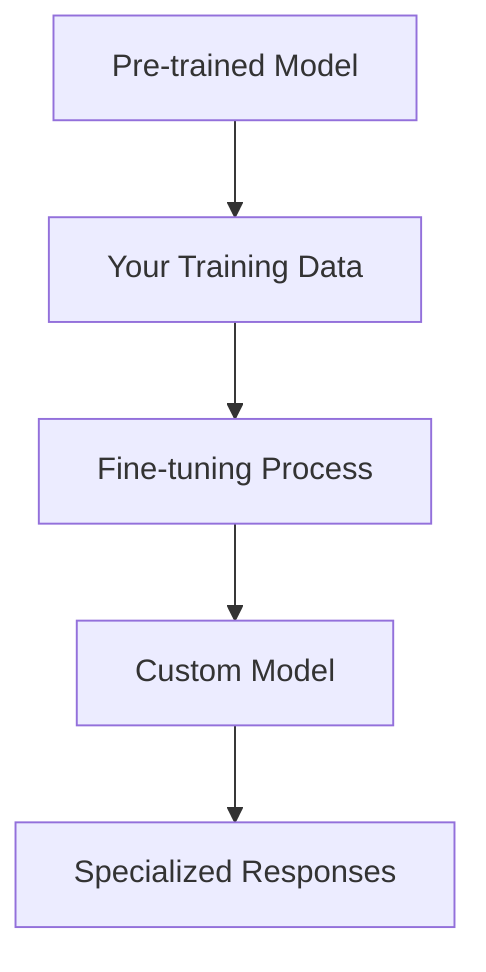
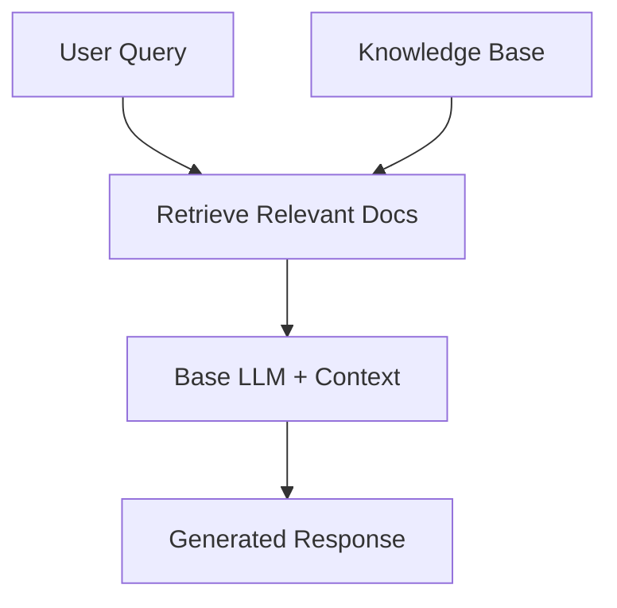

# RAG vs Fine-tuning: Choosing the Right Approach

Understanding when to use RAG versus fine-tuning is crucial for building effective AI applications. Let's explore the differences, trade-offs, and decision criteria.

---

## What is Fine-tuning?

Fine-tuning involves training a pre-trained language model on your specific dataset to adapt it to your domain or task. The model learns patterns from your data and incorporates that knowledge into its parameters.



---

## What is RAG?

RAG keeps the base model unchanged but provides it with relevant context retrieved from external knowledge sources at query time.



---

## Key Differences

### Fine-tuning Characteristics
- **Knowledge Storage**: Baked into model parameters
- **Update Process**: Requires retraining for new information
- **Response Time**: Fast (no retrieval step)
- **Hallucination Risk**: Can generate plausible but incorrect information
- **Cost**: High training costs, low inference costs
- **Scalability**: Limited by model size

### RAG Characteristics
- **Knowledge Storage**: External, updatable database
- **Update Process**: Add/update documents without retraining
- **Response Time**: Slightly slower (includes retrieval)
- **Hallucination Risk**: Lower (grounds responses in retrieved context)
- **Cost**: Low setup, moderate inference costs
- **Scalability**: Highly scalable knowledge base

---

## When to Use Fine-tuning

Choose fine-tuning when you need:

### 🎯 **Style and Format Adaptation**
```typescript
// Fine-tuning excels at learning specific output formats
const examples = [
  "Input: Customer complaint about billing",
  "Output: Ticket #12345 - BILLING - HIGH - Assigned to Sarah M."
];
```

### 🔧 **Domain-Specific Language**
- Medical terminology and abbreviations
- Legal document structure
- Technical jargon and conventions

### ⚡ **Low Latency Requirements**
- Real-time chat applications
- Embedded systems with limited connectivity
- High-frequency API calls

### 🎨 **Creative Tasks**
- Brand voice and tone
- Writing style consistency
- Creative content generation

---

## When to Use RAG

Choose RAG when you need:

### 📚 **Frequently Updated Information**
```typescript
// RAG handles dynamic information seamlessly
const knowledgeBase = {
  "latest_product_features": "Updated daily from documentation",
  "company_policies": "HR updates monthly",
  "market_data": "Real-time financial feeds"
};
```

### 🔍 **Factual Question Answering**
- Customer support knowledge bases
- Technical documentation lookup
- Research and analysis tasks

### 📈 **Scalable Knowledge Management**
- Large document collections
- Multi-tenant applications
- Growing knowledge bases

### 🎯 **Source Attribution Requirements**
- Legal and compliance applications
- Academic research tools
- Fact-checking systems

---

## Hybrid Approaches

Sometimes the best solution combines both approaches:

### Fine-tuned RAG
```typescript
// Fine-tune a model specifically for RAG tasks
const ragModel = {
  baseModel: "Fine-tuned for retrieval understanding",
  retrievalSystem: "Domain-specific vector database",
  benefit: "Better context utilization + domain knowledge"
};
```

### Staged Approach
1. **Start with RAG** for rapid prototyping
2. **Collect user interactions** and edge cases  
3. **Fine-tune** on successful RAG interactions
4. **Deploy hybrid system** with both approaches

---

## Decision Framework

Use this framework to choose the right approach:

### 📊 **Information Characteristics**
- **Static knowledge** → Fine-tuning
- **Dynamic/changing information** → RAG
- **Mix of both** → Hybrid approach

### 💰 **Resource Constraints**
- **High compute budget** → Fine-tuning
- **Limited training resources** → RAG
- **Long-term cost efficiency** → Analyze per use case

### 🎯 **Accuracy Requirements**
- **High factual accuracy needed** → RAG (with sources)
- **Style consistency critical** → Fine-tuning
- **Both required** → Hybrid approach

### ⏱️ **Update Frequency**
- **Information changes frequently** → RAG
- **Stable knowledge domain** → Fine-tuning
- **Planned update cycles** → Either approach

---

## Real-World Examples

### RAG Success Stories
- **Customer Support**: Zendesk-style help systems
- **Developer Tools**: GitHub Copilot for documentation
- **Research**: Scientific literature search and summarization

### Fine-tuning Success Stories  
- **Code Generation**: GitHub Copilot for specific programming languages
- **Content Creation**: Brand-specific writing assistants
- **Specialized Domains**: Medical diagnosis assistance

---

## Making Your Decision

Ask yourself these questions:

1. **How often does your knowledge change?**
   - Daily/Weekly → RAG
   - Monthly/Yearly → Consider fine-tuning

2. **Do you need to cite sources?**
   - Yes → RAG
   - No → Either approach

3. **What's your primary constraint?**
   - Latency → Fine-tuning
   - Accuracy → RAG
   - Cost → Analyze your specific case

4. **How specialized is your domain?**
   - Very specialized → Fine-tuning
   - General knowledge → RAG

---

## Next Steps

Now that you understand the trade-offs, we'll dive deep into building RAG systems. You'll learn:

- Vector embeddings and similarity search
- Building robust retrieval pipelines
- Handling edge cases and optimizing performance
- When to consider hybrid approaches

Ready to build your first RAG system? Let's explore vector mathematics! 🚀

---

## 💡 Quick Exercise

**Scenario Analysis**: For each scenario below, decide whether to use RAG, fine-tuning, or a hybrid approach:

1. **Legal Document Assistant**: Needs to stay current with changing regulations
2. **Creative Writing Tool**: Must match a specific author's style
3. **Medical Research Helper**: Requires access to latest research papers
4. **Customer Service Bot**: Needs company-specific tone + current policies

**Discussion**: Think about your reasoning and we'll review in the next lesson!
